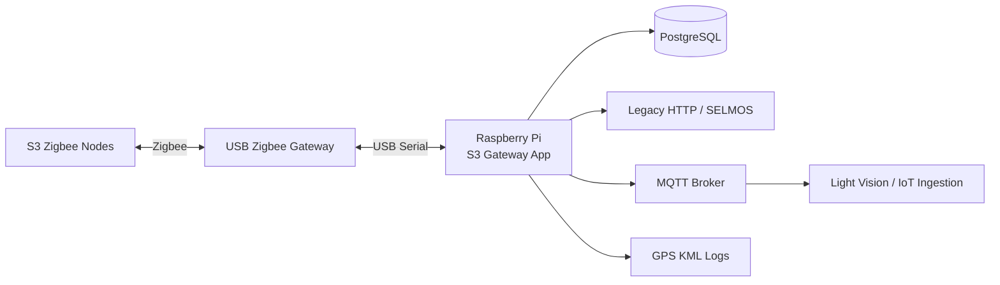
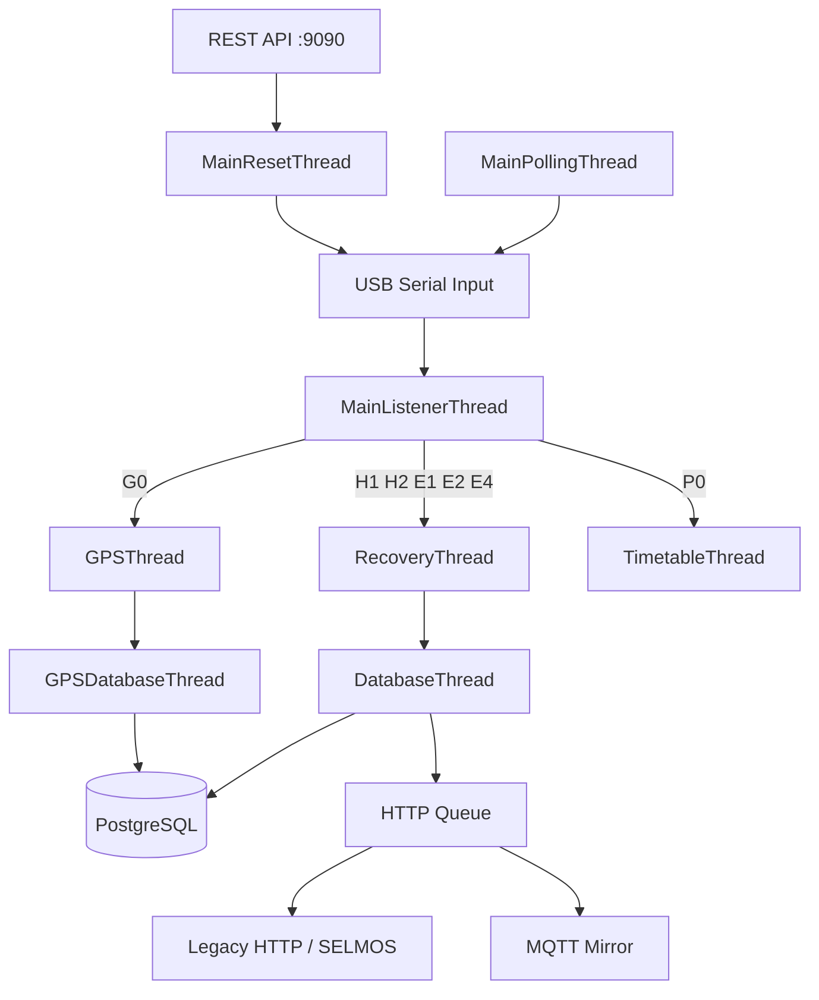

# S3 Zigbee Gateway

Production gateway software for S3 Zigbee street-light nodes running on a Raspberry Pi with a USB Zigbee gateway.

The gateway polls and receives node telemetry, validates and stores data in PostgreSQL, forwards heartbeat data upstream, mirrors telemetry to MQTT, exposes legacy REST control endpoints, performs GPS mapping, and includes protected recovery/maintenance tooling for production deployment.

---

## At a glance



### Production responsibilities

| Team | Main responsibility | Main document |
|---|---|---|
| **Project Team** | Operate the installed gateway and manage site configuration/node inventory | [`docs/HANDOVER_PROJECT_TEAM_OPERATIONS.md`](docs/HANDOVER_PROJECT_TEAM_OPERATIONS.md) |
| **Production Team** | Build, provision, validate and deliver new/replacement Raspberry Pi gateways | [`docs/HANDOVER_PRODUCTION_TEAM_BUILD.md`](docs/HANDOVER_PRODUCTION_TEAM_BUILD.md) |
| **IoT / Development** | Application changes, defects, protocol/backend changes and future enhancements | [`docs/TECHNICAL_ARCHITECTURE.md`](docs/TECHNICAL_ARCHITECTURE.md) |

For the complete documentation map, start at [`docs/README.md`](docs/README.md).

---

## Repository layout

```text
s3-zigbee-gateway/
├── PYSerialGateway/                  # launcher, site config, operator assets
├── pyserialgateway/                  # application modules
│   ├── PYGatewayListener/            # polling, DB, REST, recovery, GPS, serial logic
│   └── mqtt_service/                 # MQTT transport and mirroring
├── deploy/
│   ├── systemd/                      # base service, GPSUP override, maintenance timer
│   ├── sudoers/                      # restricted hardware reset permission
│   └── logrotate/                    # log retention configuration
├── scripts/
│   ├── bootstrap-production-pi.sh    # blank/new Raspberry Pi preparation
│   ├── deploy-production.sh          # safe application deployment / upgrade
│   ├── s3-gateway-dbup               # operator DB synchronization wrapper
│   ├── install-runtime-hardening.sh  # GPSUP + restricted reset hardening
│   ├── install-log-retention.sh      # maintenance/log retention setup
│   └── validate-handover.sh          # read-only production acceptance check
├── docs/                             # handover, operations and technical documents
├── tests/                            # regression and deployment tests
├── requirements.txt
└── .env.example
```

---

## Runtime architecture



The gateway currently operates **one active Zigbee serial gateway per running gateway process**. Simultaneous two-USB/two-channel operation is intentionally deferred as future development.

---

## Production paths

### Existing gateway: deploy or upgrade

Use this path for an already-provisioned production gateway:

```text
Approved source
    ↓
scripts/deploy-production.sh
    ↓
Runtime hardening + operator paths
    ↓
Service validation
```

Command:

```bash
cd ~/gateway-test/s3-zigbee-gateway
sudo ./scripts/deploy-production.sh
```

The deployment preserves production state such as `.env`, `.venv`, site configuration, node inventory and runtime logs while replacing deploy-managed application code.

### New/blank Raspberry Pi

Use this path only when building a new production unit:


Start with:

```bash
sudo bash scripts/bootstrap-production-pi.sh
```

**Do not run the bootstrap script on an existing production gateway.** It is designed for a blank/new runtime and refuses a populated `/opt/s3-gateway/app`.

See [`docs/HANDOVER_PRODUCTION_TEAM_BUILD.md`](docs/HANDOVER_PRODUCTION_TEAM_BUILD.md) for the complete production procedure.

---

## Project Team operations

Normal Project Team work happens under:

```text
/home/pi/S3Gateway/
```

```text
/home/pi/S3Gateway/
├── samplelist.csv        # complete desired site node inventory
├── pygw_conf.py          # approved site gateway/PAN/channel settings
├── README-OPERATOR.md
├── log/
│   ├── gateway.log
│   ├── mqtt.log
│   └── error.log
└── GPSlog/
```

Project Team should **not** edit `/opt/s3-gateway/app/` during normal operation.

### Apply node or PAN/channel changes

After editing the operator files:

```bash
sudo s3-gateway-dbup
```

The wrapper validates the files, backs up PostgreSQL and production configuration, performs one-shot DB synchronization, restarts the gateway and verifies service recovery.

See [`docs/HANDOVER_PROJECT_TEAM_OPERATIONS.md`](docs/HANDOVER_PROJECT_TEAM_OPERATIONS.md).

---

## Quick health check

### Service

```bash
sudo systemctl is-enabled s3-zigbee-gateway
sudo systemctl is-active s3-zigbee-gateway
ps -ef | grep '[p]ygw_main.py'
```

Expected production process includes:

```text
pygw_main.py GPSUP
```

### Node database

```bash
sudo -u s3gw psql -d "serial-gateway-program" -c \
"SELECT pan_id, channel, COUNT(*) FROM node_database GROUP BY pan_id, channel ORDER BY pan_id, channel;"
```

### Logs

```bash
tail -n 50 ~/S3Gateway/log/gateway.log
tail -n 50 ~/S3Gateway/log/mqtt.log
tail -n 50 ~/S3Gateway/log/error.log
```

### USB Zigbee gateway

```bash
lsusb | grep -i 'CP210'
ls -l /dev/ttyUSB*
```

---

## Handover validation

Run the read-only acceptance check on an installed gateway:

```bash
sudo bash scripts/validate-handover.sh
```

Checks include:

- gateway service enabled and active;
- service running as `s3gw` with `GPSUP`;
- operator workspace and GPS access;
- protected runtime permissions;
- restricted hardware-reset sudo rule;
- PostgreSQL connectivity and required tables;
- node database population;
- log-maintenance timer;
- CP210x/ttyUSB detection;
- MQTT connection evidence.

Acceptance target:

```text
HANDOVER RESULT: PASS
```

Latest validated production reference during this handover work:

```text
PASS=30 WARN=0 FAIL=0
HANDOVER RESULT: PASS
```

---

## Testing

### Handover/deployment asset tests

```bash
/opt/s3-gateway/app/.venv/bin/python \
  -m unittest tests.test_handover_assets -v
```

Expected:

```text
Ran 7 tests
OK
```

### Full regression suite

```bash
/opt/s3-gateway/app/.venv/bin/python \
  -m unittest discover -s tests -v
```

Current validated result:

```text
Ran 48 tests
OK
```

One test intentionally logs a mocked `RuntimeError: mqtt unavailable` to verify MQTT mirroring failure does **not** break the legacy HTTP queue. If that test ends in `ok`, the traceback is expected test behavior. The full suite passed with that expected mock output. fileciteturn146file0L48-L124

---

## REST control API

The legacy control API listens on port `9090`.

| Function | Route | Serial command |
|---|---|---|
| Poll | `/gateway-serial-listener/poll-node/<nodes>` | `+PM` |
| Find me | `/gateway-serial-listener/find-me/<nodes>` | `+TFM` |
| Manual override ON | `/gateway-serial-listener/enable-manual-override/<nodes>` | `+LM1` |
| Manual override OFF | `/gateway-serial-listener/disable-manual-override/<nodes>` | `+LM0` |
| Lamp ON | `/gateway-serial-listener/on-node/<nodes>` | `+LCB` |
| Lamp OFF | `/gateway-serial-listener/off-node/<nodes>` | `+LCC` |
| Dim | `/gateway-serial-listener/dim-node/<nodes>` | `+LCD` |
| Dim level | `/gateway-serial-listener/dim-level-node/<level>/<nodes>` | `+LC<level>` |

Timetable verification (`P0`) remains part of the legacy recovery logic. A public Set Timetable / Set Active Profile API is not part of the current handover baseline.

---

## MQTT path

```text
Validated S3 node packet
        ↓
Existing HTTP queue remains intact
        ↓
MQTT mirror adapter
        ↓
MQTT broker
        ↓
Light Vision / IoT ingestion
```

MQTT mirroring is designed so a mirroring failure does not break the existing HTTP path.

Useful check:

```bash
tail -n 100 ~/S3Gateway/log/mqtt.log | \
grep -E 'broker connected|gateway status published|transport ready|disconnected|connection attempt'
```

See [`docs/S3_Zigbee_Gateway_MQTT_Startup_and_Logging_SOP.md`](docs/S3_Zigbee_Gateway_MQTT_Startup_and_Logging_SOP.md).

---

## Security / production protections

The production design includes:

- dedicated `s3gw` service account;
- `dialout` serial-device access;
- protected `/opt/s3-gateway/app` code path;
- restricted root sudo permission for only the approved hardware reset script;
- no broad `NOPASSWD: ALL` permission;
- production `.env` excluded from deployment replacement;
- operator writes separated into `/home/pi/S3Gateway/`;
- deployment rollback/backup behavior;
- periodic log maintenance.

Never commit production MQTT passwords, certificates or site secrets into Git.

---

## CLI modes

The launcher supports the following runtime flags:

| Flag | Purpose |
|---|---|
| `GPSUP` | Enable GPS mapping polling |
| `DBUP` | Synchronize the CSV inventory during runtime startup |
| `DBUP_ONLY` | Synchronize DB once and exit before normal gateway runtime |
| `DEMOUP` | Disable autonomous recovery actions |
| `NOPOLL` | Disable active polling |
| `NOSELMOS` | Disable upstream HTTP delivery |
| `NOAUTH` | Disable HTTP basic auth where applicable |
| `TESTUP` | Use test-server behavior |

Production systemd uses `GPSUP`. Project Team DB synchronization must use the approved `sudo s3-gateway-dbup` wrapper instead of launching `DBUP`/`DBUP_ONLY` manually.

---

## Documentation map

| Document | Audience | Use |
|---|---|---|
| [`docs/README.md`](docs/README.md) | Everyone | Documentation navigation |
| [`docs/HANDOVER_INDEX.md`](docs/HANDOVER_INDEX.md) | Handover owner | Ownership and acceptance checklist |
| [`docs/HANDOVER_PROJECT_TEAM_OPERATIONS.md`](docs/HANDOVER_PROJECT_TEAM_OPERATIONS.md) | Project Team | Daily operation and first-line troubleshooting |
| [`docs/HANDOVER_PRODUCTION_TEAM_BUILD.md`](docs/HANDOVER_PRODUCTION_TEAM_BUILD.md) | Production Team | Blank-Pi build and provisioning |
| [`docs/TECHNICAL_ARCHITECTURE.md`](docs/TECHNICAL_ARCHITECTURE.md) | IoT / Development | Detailed internals |
| [`docs/S3_Zigbee_Gateway_MQTT_Startup_and_Logging_SOP.md`](docs/S3_Zigbee_Gateway_MQTT_Startup_and_Logging_SOP.md) | Project / IoT | MQTT checks and logging |

---

## Deferred future work

The following are deliberately outside the current handover baseline:

- simultaneous two-USB/two-channel operation;
- multi-instance gateway service architecture;
- USB-specific reset isolation for multi-channel operation;
- new Set Timetable / Set Active Profile APIs;
- new MQTT command/control behavior;
- database schema redesign;
- Zigbee protocol/firmware redesign.

These items should not block the current Project Team / Production Team handover.
