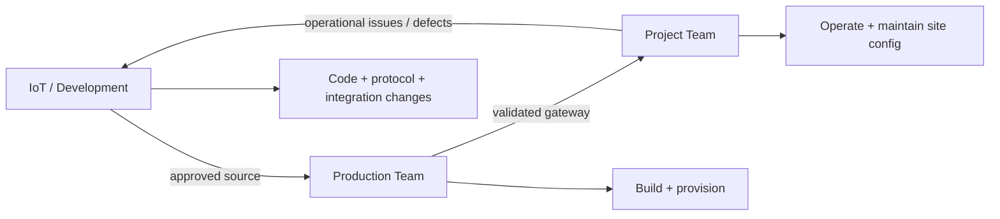
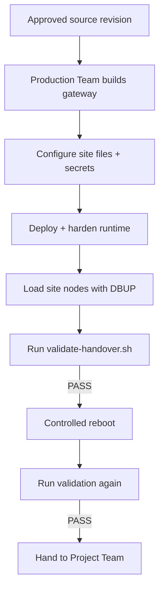

# S3 Zigbee Gateway — Handover Index

This document defines **who owns what**, which SOP each team follows, and the acceptance gate for handing a gateway over to site operations.

---

## Ownership model



| Team | Owns | Does not own |
|---|---|---|
| **Project Team** | Day-to-day operation, node inventory, approved PAN/channel changes, DBUP, logs, GPS files, first-line checks | Application deployment, source changes, DB schema changes |
| **Production Team** | Raspberry Pi preparation, gateway app installation, service setup, PostgreSQL, runtime hardening, final production validation | Feature development or protocol redesign |
| **IoT / Development** | Source code, defects, protocol/backend integration, architecture changes, future enhancements | Routine site operation |

---

## Documentation by role

| Need | Document |
|---|---|
| Operate an installed gateway | [`HANDOVER_PROJECT_TEAM_OPERATIONS.md`](HANDOVER_PROJECT_TEAM_OPERATIONS.md) |
| Build/provision a new gateway | [`HANDOVER_PRODUCTION_TEAM_BUILD.md`](HANDOVER_PRODUCTION_TEAM_BUILD.md) |
| Understand application internals | [`TECHNICAL_ARCHITECTURE.md`](TECHNICAL_ARCHITECTURE.md) |
| Check MQTT startup/logging | [`S3_Zigbee_Gateway_MQTT_Startup_and_Logging_SOP.md`](S3_Zigbee_Gateway_MQTT_Startup_and_Logging_SOP.md) |
| Repository overview | [`../README.md`](../README.md) |

---

## Handover flow



---

## Acceptance command

Run on the completed production gateway:

```bash
cd ~/gateway-test/s3-zigbee-gateway
sudo bash scripts/validate-handover.sh
```

Acceptance target:

```text
HANDOVER RESULT: PASS
```

The validation checks:

- gateway service enabled and active;
- `s3gw` runtime with `GPSUP`;
- operator workspace and GPS/log write paths;
- protected runtime permissions;
- restricted hardware-reset sudo rule;
- PostgreSQL connectivity, schema and node population;
- log-maintenance timer;
- CP210x / `/dev/ttyUSB*` detection;
- recent MQTT connection evidence.

`PASS WITH WARNINGS` requires an explicit documented review. Any `FAIL` blocks handover.

---

## Project Team acceptance

Project Team must be able to demonstrate:

- [ ] Check service status.
- [ ] Restart the gateway and verify recovery.
- [ ] Confirm `pygw_main.py GPSUP` is running.
- [ ] Edit the approved site node inventory.
- [ ] Identify/edit approved PAN/channel values.
- [ ] Run `sudo s3-gateway-dbup` safely.
- [ ] Verify node counts after DBUP.
- [ ] Read gateway, MQTT and error logs.
- [ ] Retrieve GPS KML files.
- [ ] Identify when an issue must be escalated.

---

## Production Team acceptance

Production Team must be able to demonstrate:

- [ ] Prepare a gateway from approved Raspberry Pi OS.
- [ ] Obtain and record the approved Git revision.
- [ ] Run the blank-Pi bootstrap path.
- [ ] Configure production `.env` and site files securely.
- [ ] Deploy the application and runtime hardening.
- [ ] Install/verify PostgreSQL, service account and systemd service.
- [ ] Install/verify log maintenance.
- [ ] Load site nodes using `s3-gateway-dbup`.
- [ ] Detect the Zigbee USB gateway.
- [ ] Validate MQTT, GPSUP and runtime protections.
- [ ] Reboot and confirm automatic recovery.
- [ ] Deliver `/home/pi/S3Gateway/` ready for Project Team operation.

---

## Protected boundaries

### Project Team working area

```text
/home/pi/S3Gateway/
```

### Protected production runtime

```text
/opt/s3-gateway/app/
```

Normal Project Team work must not directly modify the protected runtime.

---

## Frozen future work

The following are deliberately deferred and do **not** block the current handover:

- simultaneous two-USB/two-channel operation;
- multi-instance gateway service architecture;
- USB-specific hardware-reset isolation for multi-channel operation;
- new Set Timetable / Set Active Profile APIs;
- new MQTT command/control behavior;
- database schema redesign;
- Zigbee protocol/firmware redesign.

---

## Release-control rule

The handover work was developed from:

```text
feature/daily-log-retention
```

Production builds must use an **approved commit/tag/release revision**. Do not use a branch name alone as final release identification.
