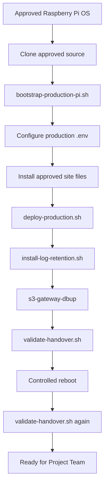

# S3 Zigbee Gateway — Production Build & Provisioning

Use this SOP to build a **new or replacement gateway from a blank Raspberry Pi** and deliver it ready for Project Team operation.

Production Team owns build/provisioning. Application feature changes remain an IoT / Development responsibility.

---

## Production flow



---

## Required inputs

Production must receive:

| Input | Required |
|---|---|
| Raspberry Pi + approved power/storage | Yes |
| Approved Raspberry Pi OS image/version | Yes |
| Approved Git repository + exact commit/tag | Yes |
| Site `samplelist.csv` | Yes |
| Site `pygw_conf.py` values | Yes |
| Production `.env` values | Yes |
| Encrypted `required-<site>gw.zip` bundle | Yes |
| Zigbee USB gateway | Yes |
| Gateway node ID / PAN ID / channel | Yes |

Do not use development credentials or test broker settings in a production unit.

---

## 1. Prepare Raspberry Pi OS

Minimum expected state:

```text
hostname configured
network available
SSH configured per company policy
correct timezone/system clock
package manager working
pi operator account available
```

Check:

```bash
hostnamectl
ip addr
ip route
timedatectl
```

Update the OS:

```bash
sudo apt update
sudo apt upgrade -y
```

Reboot if required.

---

## 2. Obtain the approved source

Example:

```bash
mkdir -p ~/gateway-build
cd ~/gateway-build

git clone git@github.com:theijattomoto/s3-zigbee-gateway.git
cd s3-zigbee-gateway

git fetch origin
git checkout <approved-branch-or-tag>
git pull
```

Record the exact revision:

```bash
git status
git log -1 --oneline
git status --porcelain
```

Expected `git status --porcelain`: empty.

---

## 3. Run fresh-Pi bootstrap

For a blank/new Raspberry Pi:

```bash
cd ~/gateway-build/s3-zigbee-gateway
sudo bash scripts/bootstrap-production-pi.sh
```

The bootstrap prepares:

```text
OS packages
  ↓
s3gw service account + dialout access
  ↓
PostgreSQL role/database/schema
  ↓
/opt/s3-gateway/app
  ↓
Python .venv + requirements
  ↓
base .env
  ↓
operator workspace seed
  ↓
base systemd service
```

The script intentionally refuses a populated `/opt/s3-gateway/app` so it cannot be used accidentally as an upgrade tool.

For an **existing gateway**, use `scripts/deploy-production.sh` instead.

---

## 4. Configure production `.env`

Edit:

```bash
sudo nano /opt/s3-gateway/app/.env
```

Review at minimum:

```text
DB_USER=s3gw
MQTT_ENABLED=true
MQTT_BROKER=<production broker>
MQTT_PORT=<production port>
MQTT_USERNAME=<approved username>
MQTT_PASSWORD=<approved password>
MQTT_TLS=<approved value>
MQTT_CA_CERT=<approved CA path when required>
MQTT_TOPIC_ROOT=s3/zigbee
GATEWAY_ID=<unique gateway ID>
MQTT_LOG_FILE=/home/pi/S3Gateway/log/mqtt.log
GATEWAY_LOG_DIR=/home/pi/S3Gateway/log
GATEWAY_ERROR_LOG_DIR=/home/pi/S3Gateway/log
```

Protect it:

```bash
sudo chown root:s3gw /opt/s3-gateway/app/.env
sudo chmod 640 /opt/s3-gateway/app/.env
```

Never commit production secrets into Git.

---

## 5. Install approved site configuration

Project Team working copies are stored under:

```text
/home/pi/S3Gateway/
```

Install/replace the approved files:

```text
/home/pi/S3Gateway/samplelist.csv
/home/pi/S3Gateway/pygw_conf.py
```

Gateway network tuple format:

```python
first_GW_data = ('FE01', '1001', '11')
second_GW_data = ('FE02', '1001', '11')
```

Meaning:

```text
(gateway_node_id, pan_id, channel)
```

Confirm the matching encrypted bundle exists in the application package:

```text
/opt/s3-gateway/app/pyserialgateway/required-<site>gw.zip
```

`cert_codename` in `pygw_conf.py` must match the bundle naming.

---

## 6. Deploy the production runtime

Run:

```bash
cd ~/gateway-build/s3-zigbee-gateway
sudo ./scripts/deploy-production.sh
```

This deployment path manages:

- deploy-managed application code;
- operator workspace/log permissions;
- `s3-gateway-dbup` installation;
- GPS operator access;
- `GPSUP` systemd override;
- restricted hardware-reset sudo rule;
- privileged reset-path protection;
- startup assertions and rollback behavior.

Do not repeatedly rerun a failed deployment without reviewing the reported cause.

---

## 7. Install log retention

```bash
sudo bash scripts/install-log-retention.sh
```

Verify:

```bash
systemctl is-enabled s3-gateway-log-maintenance.timer
systemctl is-active s3-gateway-log-maintenance.timer
```

Expected:

```text
enabled
active
```

---

## 8. Load the site node database

Run only the approved wrapper:

```bash
sudo s3-gateway-dbup
```

Verify counts:

```bash
sudo -u s3gw psql -d "serial-gateway-program" -c \
"SELECT pan_id, channel, COUNT(*) FROM node_database GROUP BY pan_id, channel ORDER BY pan_id, channel;"
```

---

## 9. Connect and verify Zigbee USB hardware

```bash
lsusb | grep -i 'CP210'
ls -l /dev/ttyUSB*
```

The managed systemd unit runs as `s3gw` with `dialout` serial access.

Current handover baseline: **one active Zigbee USB gateway per running process**. Multi-USB/multi-channel support is deferred.

---

## 10. Run acceptance validation

```bash
sudo bash scripts/validate-handover.sh
```

Required result:

```text
HANDOVER RESULT: PASS
```

The script verifies service state, GPSUP, operator paths, runtime protection, restricted sudo, PostgreSQL, USB hardware, maintenance timer and MQTT evidence.

---

## 11. Controlled reboot acceptance

Reboot:

```bash
sudo reboot
```

After reconnecting:

```bash
sudo systemctl is-enabled s3-zigbee-gateway
sudo systemctl is-active s3-zigbee-gateway
ps -ef | grep '[p]ygw_main.py'
systemctl is-active s3-gateway-log-maintenance.timer
```

Then rerun:

```bash
cd ~/gateway-build/s3-zigbee-gateway
sudo bash scripts/validate-handover.sh
```

The unit is not ready for delivery unless automatic recovery passes after reboot.

---

## 12. Production test suite

### Handover assets

```bash
/opt/s3-gateway/app/.venv/bin/python \
  -m unittest tests.test_handover_assets -v
```

Validated reference:

```text
Ran 7 tests
OK
```

### Full regression suite

```bash
/opt/s3-gateway/app/.venv/bin/python \
  -m unittest discover -s tests -v
```

Validated reference:

```text
Ran 48 tests
OK
```

The MQTT failure-isolation test intentionally emits a mocked `RuntimeError: mqtt unavailable`; the test is successful when it still ends in `ok` and the suite finishes `OK`.

---

## Production handover package

Production Team must deliver:

- completed Raspberry Pi gateway hardware;
- configured Zigbee USB gateway;
- approved source revision recorded;
- site node inventory loaded;
- PAN/channel configuration loaded;
- production service enabled and running;
- MQTT connectivity validated;
- GPSUP validated;
- log maintenance validated;
- runtime hardening validated;
- `/home/pi/S3Gateway/` ready for Project Team use;
- `README-OPERATOR.md` present.

Do not hand over secrets in an unsecured document.

---

## Acceptance checklist — Production Team

- [ ] Raspberry Pi OS prepared.
- [ ] Approved Git revision recorded.
- [ ] Fresh-Pi bootstrap completed.
- [ ] `s3gw` service account and serial access verified.
- [ ] PostgreSQL initialized.
- [ ] Production `.env` configured securely.
- [ ] Site files installed.
- [ ] Production deployment completed.
- [ ] Log retention active.
- [ ] Site DB loaded with `s3-gateway-dbup`.
- [ ] Zigbee USB detected.
- [ ] MQTT/GPSUP/runtime hardening validated.
- [ ] Regression tests passed.
- [ ] Controlled reboot passed.
- [ ] `validate-handover.sh` returns PASS after reboot.
- [ ] Operator workspace ready for Project Team.

---

## Deferred future work

Do not block handover on:

- simultaneous multi-USB/multi-channel operation;
- multi-instance service templates;
- USB-specific hardware-reset isolation;
- new Set Timetable / Set Active Profile APIs;
- application/source redesign.
