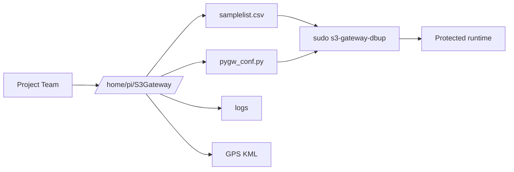

# S3 Zigbee Gateway — Project Team Operations

Use this SOP for **day-to-day operation of an installed gateway**.

The Project Team manages site operation and approved site configuration. Application deployment, source-code changes, database schema changes and protected-runtime maintenance remain outside normal Project Team scope.

---

## Quick operating model



### Operator workspace

```text
/home/pi/S3Gateway/
├── samplelist.csv
├── pygw_conf.py
├── README-OPERATOR.md
├── log/
│   ├── gateway.log
│   ├── mqtt.log
│   └── error.log
└── GPSlog/
```

### Protected runtime

```text
/opt/s3-gateway/app/
```

Do not directly edit the protected runtime during normal operation.

---

## Daily quick check

```bash
sudo systemctl is-active s3-zigbee-gateway
ps -ef | grep '[p]ygw_main.py'
tail -n 30 ~/S3Gateway/log/gateway.log
tail -n 30 ~/S3Gateway/log/mqtt.log
```

Expected:

```text
active
... pygw_main.py GPSUP
```

Healthy MQTT startup evidence normally includes:

```text
MQTT broker connected
MQTT gateway status published ... status=online
MQTT transport ready
```

---

## 1. Service control

### Status

```bash
sudo systemctl status s3-zigbee-gateway
```

### Restart

```bash
sudo systemctl restart s3-zigbee-gateway
```

### Stop / start

```bash
sudo systemctl stop s3-zigbee-gateway
sudo systemctl start s3-zigbee-gateway
```

After any restart:

```bash
sudo systemctl is-active s3-zigbee-gateway
ps -ef | grep '[p]ygw_main.py'
```

Do not manually launch `pygw_main.py` while systemd is managing the gateway.

---

## 2. Manage site nodes

Edit the complete site inventory:

```bash
nano ~/S3Gateway/samplelist.csv
```

Required format:

```csv
pole_node,node,pan_id,channel
R-1,8EED,1001,11
R-2,8EEE,1001,11
```

Rules:

- `node` must be a 4-character hexadecimal node ID.
- `channel` must be 11–26.
- Node IDs must not be duplicated.
- Pole IDs must not be duplicated.
- Keep `samplelist.csv` as the **complete desired site inventory**.

### Add node

Add a complete row.

### Remove node

Remove the row.

### Change node PAN/channel

Update the row and confirm the gateway network settings match the intended Zigbee network.

Do not manually edit PostgreSQL for normal node-list changes.

---

## 3. Manage gateway PAN/channel

Edit:

```bash
nano ~/S3Gateway/pygw_conf.py
```

Gateway tuple format:

```python
first_GW_data = ('FE01', '1001', '11')
second_GW_data = ('FE02', '1001', '11')
```

Meaning:

```text
(gateway_node_id, pan_id, channel)
```

The current handover baseline supports one active Zigbee USB gateway per running process. Simultaneous multi-USB/multi-channel operation is future work.

---

## 4. Apply site changes safely

After editing `samplelist.csv` and/or `pygw_conf.py`, run:

```bash
sudo s3-gateway-dbup
```

The approved wrapper:

```text
Validate operator files
        ↓
Back up PostgreSQL + current site config
        ↓
Install operator files into protected runtime
        ↓
Stop gateway
        ↓
Run one-shot DBUP_ONLY
        ↓
Restart gateway
        ↓
Verify service active
```

Do not manually run `DBUP` or `DBUP_ONLY` while the production service is active.

### Verify after DBUP

```bash
sudo systemctl is-active s3-zigbee-gateway
```

Check counts:

```bash
sudo -u s3gw psql -d "serial-gateway-program" -c \
"SELECT pan_id, channel, COUNT(*) FROM node_database GROUP BY pan_id, channel ORDER BY pan_id, channel;"
```

---

## 5. Logs and first-line checks

### Gateway

```bash
tail -n 50 ~/S3Gateway/log/gateway.log
```

### MQTT

```bash
tail -n 50 ~/S3Gateway/log/mqtt.log
```

### Errors

```bash
tail -n 50 ~/S3Gateway/log/error.log
```

### Live gateway log

```bash
tail -f ~/S3Gateway/log/gateway.log
```

Stop with `Ctrl+C`.

---

## 6. MQTT connectivity

```bash
tail -n 100 ~/S3Gateway/log/mqtt.log | \
grep -E 'broker connected|gateway status published|transport ready|disconnected|connection attempt'
```

Escalate if MQTT cannot reconnect while site Internet connectivity is already confirmed.

---

## 7. GPS files

List scans:

```bash
ls -lh ~/S3Gateway/GPSlog/
```

Newest KML:

```bash
ls -1t ~/S3Gateway/GPSlog/*_GPSscan.kml | head -1
```

Verify runtime mapping:

```bash
readlink -f /opt/s3-gateway/app/PYSerialGateway/GPSlog
```

Expected:

```text
/home/pi/S3Gateway/GPSlog
```

---

## 8. USB gateway checks

```bash
lsusb | grep -i 'CP210'
ls -l /dev/ttyUSB*
```

Do not manually run the privileged hardware-reset script unless directed by IoT/Development.

---

## 9. Controlled reboot

Reboot:

```bash
sudo reboot
```

After reconnecting:

```bash
sudo systemctl is-enabled s3-zigbee-gateway
sudo systemctl is-active s3-zigbee-gateway
ps -ef | grep '[p]ygw_main.py'
```

Expected:

```text
enabled
active
... pygw_main.py GPSUP
```

---

## 10. When to escalate

Escalate to IoT / Development when any of these persist after one controlled restart:

- gateway repeatedly exits or fails to start;
- Zigbee USB cannot be detected;
- hardware reset repeatedly fails;
- PostgreSQL or DBUP fails;
- unexpected database corruption/duplicates appear;
- MQTT cannot reconnect despite confirmed network availability;
- repeated Python traceback or software defect occurs;
- a source-code change is required.

---

## Allowed vs protected actions

| Project Team may | Project Team should not normally |
|---|---|
| Check/restart service | Edit `/opt/s3-gateway/app/` |
| Edit `samplelist.csv` | Edit Python source |
| Edit approved `pygw_conf.py` values | Change DB schema |
| Run `sudo s3-gateway-dbup` | Manually alter production DB records |
| Read logs/GPS KML | Modify systemd/sudoers |
| Perform basic USB/network checks | Modify `.venv` or deploy new code |

---

## Handover acceptance — Project Team

- [ ] Check gateway status.
- [ ] Restart gateway and verify recovery.
- [ ] Confirm `GPSUP` process.
- [ ] Read gateway/MQTT/error logs.
- [ ] Add/remove/change a node correctly.
- [ ] Identify PAN/channel settings.
- [ ] Run `sudo s3-gateway-dbup` safely.
- [ ] Verify node counts after DBUP.
- [ ] Retrieve the latest GPS KML.
- [ ] Know when to escalate.

---

## Deferred future work

- simultaneous two-USB/two-channel operation;
- new timetable/profile programming APIs;
- new MQTT command features;
- database schema redesign;
- Zigbee protocol/firmware development.
