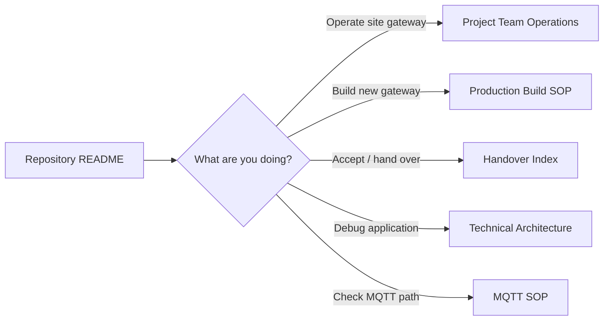

# S3 Zigbee Gateway — Documentation

This directory is the navigation point for gateway operations, production provisioning, architecture and integration references.

## Start here

| Reader | Use this document | Purpose |
|---|---|---|
| Project Team | [Project Team Operations](HANDOVER_PROJECT_TEAM_OPERATIONS.md) | Operate an installed gateway, maintain the node list and perform first-line checks. |
| Production Team | [Production Build & Provisioning](HANDOVER_PRODUCTION_TEAM_BUILD.md) | Build a new/replacement gateway from Raspberry Pi OS to handover acceptance. |
| Handover owner | [Handover Index](HANDOVER_INDEX.md) | Ownership boundaries, acceptance criteria and deferred work. |
| IoT / Development | [Technical Architecture](TECHNICAL_ARCHITECTURE.md) | Module-level gateway internals and packet-processing design. |
| MQTT integration | [MQTT Startup & Logging SOP](S3_Zigbee_Gateway_MQTT_Startup_and_Logging_SOP.md) | MQTT startup, broker/log verification and operational checks. |

## Documentation flow



## Source-of-truth rules

- Use an approved Git commit/tag for production builds; do not deploy an uncommitted working tree.
- Project Team operational changes belong in `/home/pi/S3Gateway/`, not directly in `/opt/s3-gateway/app/`.
- Production application upgrades use `scripts/deploy-production.sh`.
- New/blank Raspberry Pi preparation uses `scripts/bootstrap-production-pi.sh` first.
- Final handover acceptance uses `scripts/validate-handover.sh`.
- Simultaneous multi-USB/multi-channel operation remains deferred future work.

## Current validation commands

Static handover assets:

```bash
/opt/s3-gateway/app/.venv/bin/python \
  -m unittest tests.test_handover_assets -v
```

Full regression suite:

```bash
/opt/s3-gateway/app/.venv/bin/python \
  -m unittest discover -s tests -v
```

Installed gateway acceptance:

```bash
sudo bash scripts/validate-handover.sh
```

See the root [README](../README.md) for expected results and repository-level quick start.
