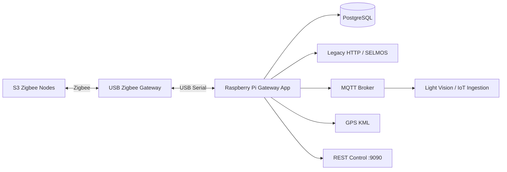
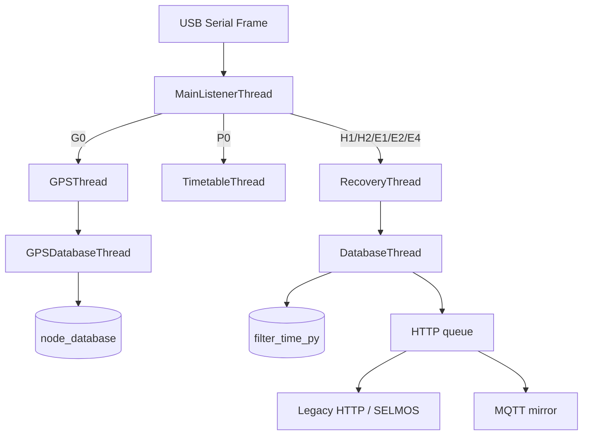
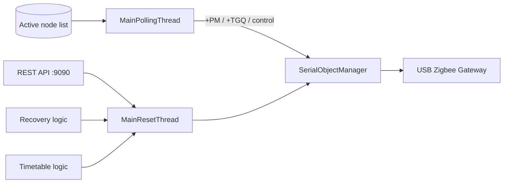

# S3 Zigbee Gateway — Technical Architecture

This document is for IoT / Development engineers who need to understand the internal runtime structure, packet flow, persistence, control path and recovery behavior of the S3 Zigbee Gateway.

For operations and provisioning, use the role-specific handover SOPs instead.

---

## System context



Primary entry point:

```text
PYSerialGateway/pygw_main.py
```

Runtime package:

```text
pyserialgateway/PYGatewayListener/
```

---

## Runtime launch

```text
systemd
  ↓
PYSerialGateway/run-service.sh
  ↓
.venv/bin/python pygw_main.py GPSUP
  ↓
pyserialgateway.PYGatewayListener.main(...)
```

Production runs with `GPSUP` through the managed systemd drop-in.

---

## Main runtime components

| Module / thread | Responsibility |
|---|---|
| `main.py` | Top-level orchestration, queues, serial lifecycle, watchdog and daily transitions |
| `serial_manager.py` | USB serial discovery, open/lock/configuration and recovery |
| `polling_thread.py` | Active heartbeat/GPS polling and time-window actions |
| `main_listener_thread.py` | Raw packet framing, filtering and dispatch by packet type |
| `recovery_thread.py` | H1/H2/E1/E2/E4 validation and recovery decisions |
| `database_thread.py` | Message-ID reconciliation and `filter_time_py` updates |
| `gps_thread.py` | GPS packet validation and mapping workflow |
| `gps_database_thread.py` | GPS persistence into `node_database` |
| `timetable_thread.py` | P0 timetable/timezone validation and corrective actions |
| `reset_thread.py` | Serialized command/reset/timetable writes to serial |
| `rest_api.py` | Legacy external control API on port 9090 |
| `http_thread.py` | Upstream HTTP/HTTPS forwarding |
| `database_aligner.py` | CSV-to-PostgreSQL inventory alignment and active-node selection |
| `mqtt_service/` | MQTT transport, status/LWT, command subscriptions and telemetry mirroring |

---

## Packet-processing flow



### Recovery path

For normal non-GPS/non-timetable packets:

```text
ID filtering
  ↓
time / packet validation
  ↓
duplicate filtering
  ↓
message-ID reconciliation
  ↓
PostgreSQL update
  ↓
HTTP forwarding + MQTT mirror
```

Invalid data may trigger corrective serial commands through `MainResetThread`.

---

## Polling and control flow



Polling behavior is driven by site timing values from `PYSerialGateway/pygw_conf.py`, including:

- `cycletime`
- `pollinggap`
- `active_time`
- `inactive_time`
- `LM_active_time`
- `node_off_time`
- `GPS_poll_time`
- `aggressive_poll_duration_mins`
- `minimum_power`

---

## Database model

### `node_database`

Stores the known site inventory and GPS information.

Key fields:

```text
pole_node
node
pan_id
channel
latitude
longitude
description
```

The active polling list is selected according to the current gateway PAN ID and channel.

### `filter_time_py`

Stores recent packet state per node/packet type:

```text
node
ack
dtime
msgid
oo_msgid
dec_count
rollover_count
miss_count
override_flag
lamp_status
```

`DatabaseThread` uses message-ID comparison to distinguish new packets, duplicates, out-of-order packets and rollover.

---

## Node inventory synchronization


Project Team must use:

```bash
sudo s3-gateway-dbup
```

rather than launching `DBUP`/`DBUP_ONLY` manually against a running production service.

---

## REST control API

The legacy REST server listens on port `9090`.

| Function | Route | Serial command |
|---|---|---|
| Poll | `/gateway-serial-listener/poll-node/<nodes>` | `+PM` |
| Find me | `/gateway-serial-listener/find-me/<nodes>` | `+TFM` |
| Manual override enable | `/gateway-serial-listener/enable-manual-override/<nodes>` | `+LM1` |
| Manual override disable | `/gateway-serial-listener/disable-manual-override/<nodes>` | `+LM0` |
| Lamp ON | `/gateway-serial-listener/on-node/<nodes>` | `+LCB` |
| Lamp OFF | `/gateway-serial-listener/off-node/<nodes>` | `+LCC` |
| Dim | `/gateway-serial-listener/dim-node/<nodes>` | `+LCD` |
| Dim level | `/gateway-serial-listener/dim-level-node/<level>/<nodes>` | `+LC<level>` |

Timetable verification is handled internally through `P0` processing and `+STQ...` queries. A public Set Timetable / Set Active Profile API is not part of the current handover baseline.

---

## MQTT architecture

```text
Validated packet accepted by existing gateway logic
        ↓
Existing HTTP queue behavior preserved
        ↓
MQTTMirroringQueue
        ↓
MQTTService background publisher
        ↓
Gateway-scoped MQTT topic
```

Important property: MQTT mirroring is isolated from the legacy HTTP queue. A mirroring exception is logged but does not prevent the existing HTTP path from receiving the packet.

The regression suite explicitly tests this failure-isolation behavior.

---

## GPS mapping

`GPSUP` enables GPS polling during the configured window.

```text
G0 packet
  ↓
GPSThread validation
  ↓
GPSDatabaseThread
  ↓
node_database update
  ↓
KMLMapManager
  ↓
/home/pi/S3Gateway/GPSlog/*.kml
```

The protected legacy runtime path:

```text
/opt/s3-gateway/app/PYSerialGateway/GPSlog
```

is mapped to:

```text
/home/pi/S3Gateway/GPSlog
```

for operator access.

---

## Serial gateway handling

`SerialObjectManager`:

1. Enumerates `/dev/ttyUSB*` devices.
2. Opens a candidate serial port.
3. Acquires an exclusive lock.
4. Queries gateway status/configuration.
5. Applies the configured gateway/PAN/channel tuple.
6. Keeps the first usable configured port.

Current architecture therefore supports one active serial gateway per process. Multi-USB/multi-channel simultaneous operation remains future work.

---

## Hardware reset recovery

The gateway may invoke:

```text
/usr/bin/python3 /opt/s3-gateway/app/pyserialgateway/hardware_reset.py
```

through a restricted sudo rule.

Production protection requirements:

- service runs as `s3gw`;
- no broad `NOPASSWD: ALL`;
- only the approved hardware-reset command is allowed;
- reset script/config are not writable by `s3gw`;
- privileged code path is root-owned.

---

## Runtime filesystem model

```text
/opt/s3-gateway/app/           protected production runtime
/home/pi/S3Gateway/            Project Team operator workspace
/opt/s3-gateway/backups/       deployment backups
```

Operator-facing files:

```text
/home/pi/S3Gateway/samplelist.csv
/home/pi/S3Gateway/pygw_conf.py
/home/pi/S3Gateway/log/
/home/pi/S3Gateway/GPSlog/
```

---

## Production systemd model

Base service:

```text
deploy/systemd/s3-zigbee-gateway.service
```

Production characteristics:

- `User=s3gw`
- `Group=s3gw`
- `SupplementaryGroups=dialout`
- environment loaded from `/opt/s3-gateway/app/.env`
- launcher `/opt/s3-gateway/app/PYSerialGateway/run-service.sh`
- GPSUP supplied by the managed drop-in
- automatic restart on failure

---

## CLI modes

| Flag | Behavior |
|---|---|
| `GPSUP` | Enable GPS mapping polling |
| `DBUP` | Synchronize node CSV during startup |
| `DBUP_ONLY` | Synchronize DB then exit before normal runtime |
| `DEMOUP` | Disable autonomous recovery actions |
| `NOPOLL` | Disable active polling |
| `NOSELMOS` | Disable upstream HTTP delivery |
| `NOAUTH` | Disable HTTP basic auth where applicable |
| `TESTUP` | Use test-server behavior |

---

## Validation and regression tests

Handover assets:

```bash
/opt/s3-gateway/app/.venv/bin/python \
  -m unittest tests.test_handover_assets -v
```

Full suite:

```bash
/opt/s3-gateway/app/.venv/bin/python \
  -m unittest discover -s tests -v
```

Current validated reference:

```text
Ran 48 tests
OK
```

The MQTT failure-isolation test intentionally emits a mocked `RuntimeError: mqtt unavailable`; it is expected when the test still ends in `ok` and the suite ends `OK`. fileciteturn146file0L48-L124

---

## Known architecture boundaries

Current baseline intentionally does not include:

- simultaneous two-USB/two-channel operation;
- per-USB hardware-reset isolation;
- multi-instance systemd template architecture;
- public Set Timetable / Set Active Profile APIs;
- schema redesign.

These are future development items rather than handover blockers.
